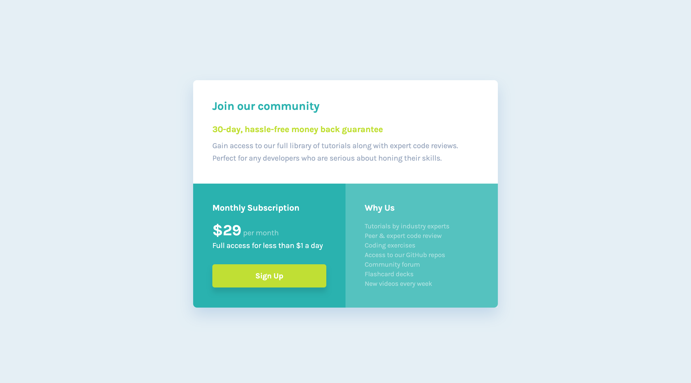
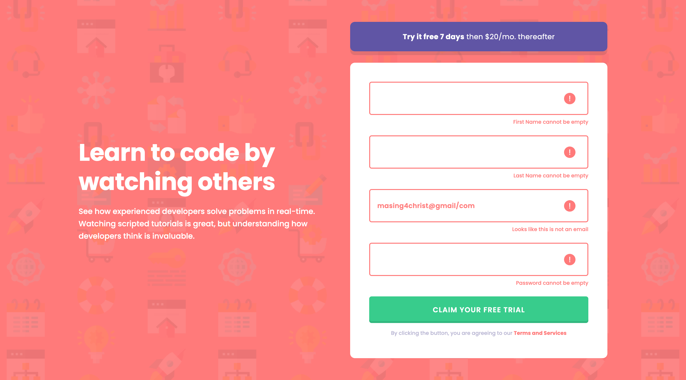

# Frontend Mentor - Intro component with sign up form solution

This is a solution to the [Intro component with sign up form challenge on Frontend Mentor](https://www.frontendmentor.io/challenges/intro-component-with-signup-form-5cf91bd49edda32581d28fd1). Frontend Mentor challenges help you improve your coding skills by building realistic projects. 

## Table of contents

- [Overview](#overview)
  - [The challenge](#the-challenge)
  - [Screenshot](#screenshot)
  - [Links](#links)
- [My process](#my-process)
  - [Built with](#built-with)
  - [What I learned](#what-i-learned)
  - [Continued development](#continued-development)
  - [Useful resources](#useful-resources)
- [Author](#author)
- [Acknowledgments](#acknowledgments)

## Overview

### The challenge

Users should be able to:

- View the optimal layout for the site depending on their device's screen size
- See hover states for all interactive elements on the page
- Receive an error message when the `form` is submitted if:
  - Any `input` field is empty. The message for this error should say *"[Field Name] cannot be empty"*
  - The email address is not formatted correctly (i.e. a correct email address should have this structure: `name@host.tld`). The message for this error should say *"Looks like this is not an email"*

### Screenshot

- Desktop





- Mobile


### Links

- [Solution URL ](https://github.com/fmanimashaun/faq-accordion)
- [Live Site URL](https://fmanimashaun.github.io/faq-accordion/)

## My process

### Built with

- Semantic HTML5 markup
- Sass
- Flexbox
- Mobile-first workflow
- TypeScript
- Vite for development and build process
- GitHub Pages for deployment

### What I learned

Clear all error when the input field get re-focused after submission. Javascript was essentially used to manage the form states.

In the styling part, I break the UI into manageable components and use as many utilities classes as possible to reduce the amount of custom styling. However, I purge the final css of all unused utility classes to ensure the final css is as small as possible.

```scss
// Generate font-weight utility classes with responsive variants
@each $weight, $value in $font-weights {
	.text-#{$weight} {
		font-weight: #{$value};
	}
}

// Generate font-style utility classes with responsive variants
@each $style, $value in $font-styles {
	.text-#{$style} {
		font-style: #{$value};
	}
}

// Generate text-align utility classes with responsive variants
@each $align, $value in $text-aligns {
	.text-#{$align} {
		text-align: #{$value};
	}
}

// Generate font-weight utility classes with responsive variants
@each $weight, $value in $font-weights {
	@each $breakpoint, $breakpoint-value in $breakpoints {
		@media screen and (min-width: #{$breakpoint-value}) {
			@at-root .#{$breakpoint}-text-#{$weight} {
				font-weight: #{$value};
			}
		}
	}
}

// Generate font-style utility classes with responsive variants
@each $style, $value in $font-styles {
	@each $breakpoint, $breakpoint-value in $breakpoints {
		@media screen and (min-width: #{$breakpoint-value}) {
			@at-root .#{$breakpoint}-text-#{$style} {
				font-style: #{$value};
			}
		}
	}
}

// Generate text-align utility classes with responsive variants
@each $align, $value in $text-aligns {
	@each $breakpoint, $breakpoint-value in $breakpoints {
		@media screen and (min-width: #{$breakpoint-value}) {
			@at-root .#{$breakpoint}-text-#{$align} {
				text-align: #{$value};
			}
		}
	}
}
```

```ts
// Add event listener on the form to remove invalid classes from all inputs when any input is focused
formEl.addEventListener('focusin', (e) => {
	// Check if the event target is an input
	if (e.target instanceof HTMLInputElement) {
		const inputs = formEl.querySelectorAll('input') as NodeListOf<HTMLInputElement>;
		const errors = formEl.querySelectorAll('.error-message') as NodeListOf<HTMLElement>;

		// Loop through all input elements and remove invalid classes from all
		inputs.forEach((input) => {
			input.classList.remove('invalid');
			if (input.parentElement) {
				input.parentElement.classList.remove('invalid');
			}
		});

	// Update error messages on the form
	errors.forEach((error) => {
		error.innerText = '';
	});
	}
});

```

### Continued development

I plan to explore advanced SASS features to enhance the maintainability and scalability of my stylesheets. I also intend to further integrate TypeScript in future frontend projects to reinforce type safety and streamline debugging.

### Useful resources

- [CSS-Tricks: Flexbox Guide](https://css-tricks.com/snippets/css/a-guide-to-flexbox/) - This guide was instrumental in implementing the flexible layout of the component.
- [MDN Web Docs: CSS Display Property](https://developer.mozilla.org/en-US/docs/Web/CSS/display) - Helped me with controlling element visibility.
- [Frontend Mentor Community](https://www.frontendmentor.io/community) - Engaging with other developers in the community provided insights and useful tips for handling responsive layouts.

## Author

👤 **Engr. Animashaun Fisayo**

- [GitHub](https://github.com/fmanimashaun)
- [Twitter](https://twitter.com/fmanimashaun)
- [LinkedIn](https://www.linkedin.com/in/fmanimashaun/)
- [Website](https://fmanimashaun.com)
- [Blog](https://blog.fmanimashaun.com)


## Acknowledgments

This project was completed as part of the [Frontend Mentor](https://www.frontendmentor.io/) challenge. The platform provided an excellent opportunity to practice and refine my front-end skills through realistic project challenges.